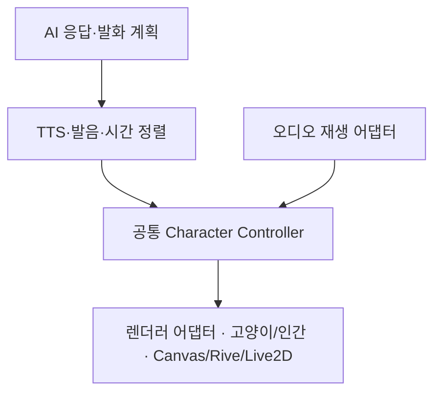

# 연이 공통 Character Controller·한국어 립싱크 설계 기준

반영일: 2026-09-29 (한국시간). 사용자의 추가 지시를 후속 구현 기준으로 고정한다.
**이 문서는 설계와 완료 조건이다. 아래 미구현 항목의 구현·검증 완료를 의미하지 않는다.**
CSS + Canvas 2D PoC를 유지하고 고양이형부터 검증한다. 인간형 A안도 같은 제어 계약을 따른다.

## 현재 구현과 보완할 부분

| 항목 | 현재 코드 | 다음 구현에서 충족할 조건 |
| --- | --- | --- |
| 음소 기반 선택 | `lib/yeoni/lip-sync.ts`가 정렬된 음소 구간을 viseme으로 변환 | 한국어 발음 변환·실제 음성 정렬 단계의 입출력 계약을 연결 |
| 입 모양 | `round`는 우/오, `wide`는 이/에를 공유 | 닫힘/아/이/우/에/오를 각각 구분 |
| 오디오 시계 | `LipSyncPlayer`가 HTMLAudioElement의 현재 시각 사용 | 미디어 요소 처리는 재생 어댑터, 입 모양·행동 판정은 공통 Controller로 분리 |
| 렌더러 | `cat-renderer.ts`가 Canvas 그리기와 일부 동작 판정을 함께 수행 | 공통 상태·타이밍 판정과 Canvas 자산·좌표 처리를 분리 |
| 실제 음성 | 승인된 39자 Zephyr MP3 저장, 정상 디코딩 확인 | 음소 정렬·입 모양 동기화·청취 검수 필요 |
| 인간형·대체 엔진 | 아직 공통 Controller에 연결되지 않음 | 같은 입력과 제어 로직에 외형별 렌더러만 연결 |

기존 `rest`와 `closed`는 같은 닫힌 입을 그리며, 나머지는 small/open/round/wide다.
따라서 현재 다섯 시각적 형태를 사용자 지정 여섯 입 모양 세트의 완성으로 보지 않는다.

## 공통 처리 흐름과 책임

| 계층 | 담당 | 넣지 않을 처리 |
| --- | --- | --- |
| AI·발화 계획 | 응답, 확정 발화문, 감정·제스처 의도 생성 | Canvas 좌표, 엔진별 파라미터 이름 |
| TTS·정렬 서비스 | 기존 무료 한도·중복 방지, 음성 확보, 발화문/음성 해시, 실제 음소 타임라인 | 프레임 그리기, 외형별 재생성 |
| 재생 어댑터 | HTMLAudioElement·Blob URL·미디어 이벤트 수명 관리, 재생 위치와 상태 제공 | 음소→입 모양 규칙, 고양이·인간 그림 |
| 공통 Controller | 발화 상태, 음소→viseme 선택, 감정·제스처 우선순위, 재생 중단 시 중립 복귀 | React/DOM/Canvas/Rive/Live2D API 호출, 별도 TTS 요청 |
| 렌더러 어댑터 | Controller의 결과를 외형 자산·좌표·엔진 파라미터로 표현, 크기·그리기 자원 관리 | AI 응답 생성, TTS 호출, 자체 발음 추정·타임라인 재계산 |

Controller가 TTS를 직접 구현하는 형태로 합치지 않는다. TTS·AI 서비스와 재생 어댑터도
렌더링 엔진과 독립적으로 유지하여 엔진 교체 후 그대로 사용할 수 있게 한다.
고양이·인간 전환은 외형 자산과 렌더러 바인딩 변경이며, 계정·기억·발화문·오디오 재생을 새로 만들지 않는다.

### 최소 계약

다음 이름은 구현할 계약의 설계명이며, 아직 존재하는 TypeScript API로 간주하지 않는다.

- `SpeechClip`: 확정 발화문, 음성 식별자/해시, 발화문 해시, 언어, 길이, 검증 상태와 음소 구간.
- `PlaybackSnapshot`: 같은 오디오의 `currentTimeMs`, playing/paused/ended/waiting/seeking/error 상태.
  진행 중단·숨김 등 브라우저 이벤트는 어댑터가 일반 상태로 전달한다.
- `CharacterFrame`: 공통 viseme ID와 표정/제스처/시선 등의 의미 값. 프레임에 DOM 노드,
  Canvas context, HTMLAudioElement, 엔진 객체를 넣지 않는다. 미구현 행동은 중립 값이다.
- `CharacterController.sample(playback, visibilityPolicy)`: 실제 재생 시각에 해당하는 프레임을 계산한다.
  시간 탐색·배속 변경 뒤에도 현재 시각으로 다시 계산하며 자체 발화 타이머를 만들지 않는다.
- `Renderer.render(frame)`와 `dispose()`: 외형 표현과 자원 정리를 담당한다.
  호스트가 외형과 렌더러를 선택하고 교체 시 자원을 해제한다. 교체 과정에서 TTS를 재요청하지 않는다.

프레임 구동 루프는 하나만 둔다. 현재 Canvas의 최대 30fps 제한과 프레임마다 React 상태를
갱신하지 않는 방식을 유지한다. 숨김·화면 밖·동작 줄이기 정책은 호스트/Controller의 명시적 입력이며,
렌더러별로 발화 규칙을 새로 정의하지 않는다. Rive/Live2D를 실제 도입할 때는 해당 엔진의 루프에 맞는
어댑터를 구현하되, Controller와 음성 시계는 변경하지 않는 것을 검증한다.

## 최소 입 모양과 한국어 매핑

아래 ID는 다음 구현에서 사용할 의미 단위다. 현행 v1의 `open/round/wide`와 이름만 바꿔
동일한 도형을 재사용한 것을 완성으로 처리하지 않는다.

| 목표 viseme | 표시 모양 | 대표 발음 | 구분 기준 |
| --- | --- | --- | --- |
| `closed` | 닫힘 | ㅁ·ㅂ·ㅃ·ㅍ의 실제 폐쇄 구간 | 입술 폐쇄, 무음은 `rest` 상태로 같은 닫힘 자산 사용 가능 |
| `a` | 아 | ㅏ | 세로로 충분히 열린 입 |
| `i` | 이 | ㅣ | 옆으로 넓고 세로 폭이 작은 입 |
| `u` | 우 | ㅜ | 작고 오므린 둥근 입 |
| `e` | 에 | ㅔ·ㅐ 계열 | 이보다 세로로 열린 가로형 입 |
| `o` | 오 | ㅗ | 우보다 개방도가 큰 둥근 입 |

이는 최소 세트이며 모든 한국어 음소를 여섯 개에 억지로 대응시키지 않는다. ㅡ·ㅓ·자음·복합모음은
실제 발음과 전후 문맥을 고려한 명시적 매핑으로 정의하고, 필요하면 `neutral` 등 보조 모양을 추가한다.
의미 ID는 고양이·인간 공통, 입의 좌표·크기·자산·엔진 파라미터는 렌더러별이다.

한국어 텍스트 정규화 → 발음 변환(G2P) → 실제 오디오와 음소 시간 정렬 → viseme 변환의 경계를 둔다.
띄어쓰기나 한글 자모 분해만으로 연음·받침·동화 등의 실제 발음을 확정하지 않는다.
발화문은 **TTS에 실제 보낸 최종 문장**이고, 음성과 해시로 묶는다. 복합모음 전이는 측정된 구간으로
나누며 글자 수에 따른 균등 분할을 하지 않는다. 미지원 음소는 추측하지 않고 검토 필요로 표시한다.

현행 v1 파일은 정렬된 음소를 저장한다. 모양 이름 확장은 타임라인 파일 버전과 별개로 관리하고,
의미/필수 필드가 달라질 때만 명시적 스키마 변경과 호환 절차를 둔다. 기존 무음 샘플은 계속
`synthetic-clock-test`로 표시하며 실제 발음 검증 증거와 섞지 않는다.

음량은 향후 보조 표정 강도 등에 사용할 수 있어도 주 viseme 선택과 발음 시각을 대신하지 않는다.
정렬이 없거나 불확실하면 중립 입과 안내를 유지하며, 임의 입 벌리기로 정확한 립싱크를 가장하지 않는다.

## 5단계 검증과 완료 조건

1. 여섯 입 모양을 정지 비교 화면과 실제 발화에서 확인한다. 특히 우/오, 이/에를 별도 이미지로 검수한다.
2. 저장된 [39자 MP3](yeoni-phase5/fixtures/zephyr-ko-39.mp3)와 정확한 문장을 재사용하여 음소 타임라인을
   만든다. 생성된 오디오와 다른 파일을 조합하지 않는다. 필요 음소가 표본에 없으면 미검증으로 남기고,
   기존 1회 생성 승인을 새로운 문장 생성의 포괄 승인으로 해석하지 않는다.
3. 실제 음성의 음소 경계를 청취·파형 등으로 검토하고 예상 viseme·실제 오디오 시각·렌더 시각을
   함께 기록한다. 선택 로직의 정확도, 시각 출력 지연, 정렬 자체의 정확도를 별도 항목으로 보고한다.
   현재의 오디오 길이 허용 오차 100ms는 코덱 길이 확인 값이며 음소 정렬 정확도 인증값이 아니다.
4. 재생·정지·끝·탐색·배속·버퍼 대기·오류·백그라운드 복귀에서 입 모양과 재생 상태를 확인한다.
   정지·끝·오류·무음에는 닫힘으로 돌아가고, 백그라운드 복귀 시 자동 발화하지 않는다.
5. 공통 Controller를 Canvas 없이 시험하고, 같은 입력/재생 시각에 대해 고양이 Canvas 렌더러와
   기록용 렌더러가 같은 프레임을 받는지 검증한다. 이 결과를 미구현 인간형이나 Rive/Live2D의 실동작
   검증으로 확대하지 않는다. Chromium·WebKit 실제 브라우저 검증을 기존 회귀 검사와 함께 남긴다.
6. 위 결과와 실제 발화 중 자연스러움을 검토한 후 사용자에게 확인 가능한 결과를 제시한다.
   음성 확보나 무음 시계 검사만으로 5단계를 완료하지 않는다. 물리 iPhone의 잠금·Bluetooth 지연은
   기존 PHASE 14/15 검증 항목으로 유지하고 데스크톱 WebKit 결과와 구분한다.

## 단계별 적용 순서

| 단계 | 이 지시로 고정할 내용 |
| --- | --- |
| PHASE 5 | 최소 공통 Controller/재생 어댑터 경계 추출 → 여섯 입 모양 → 한국어 정렬 → 실음성 동기 검증 |
| PHASE 6 | 감정·제스처를 같은 Controller의 의미 값으로 확장 |
| PHASE 7~9 | 인간형 자산·렌더러와 한국어 립싱크에 동일 Controller·음성 처리를 연결 |
| PHASE 10 | 양 외형의 공통 제어 통합·중복 제거·계약 회귀 검사 완성 |
| PHASE 11 이후 | 외형 전환 시 발화 연속성 및 이후 일본어·실제 AI·기기·성능 검증 |

이번 반영은 지침·설계·완료 기준 갱신이다. 실행 코드, 정렬 파일, 자산, 운영 배포를 바꾼 작업으로
보고하지 않는다. 전체 진도는 **4/16단계 완료, PHASE 5 진행 중**이다.
