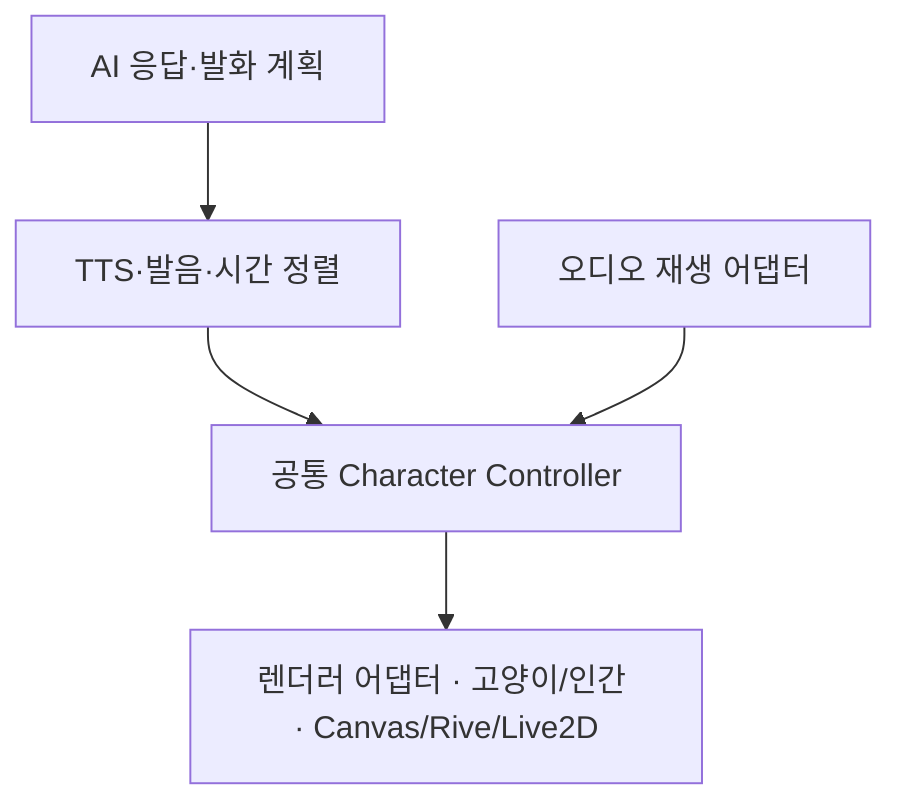

# 연이 공통 Character Controller·한국어 립싱크 설계 기준

반영일: 2026-09-30 (한국시간). 사용자의 추가 지시를 후속 구현 기준으로 고정한다.
**설계 기준과 현재 구현 상태를 함께 기록한다. PHASE 5는 청취 검토가 남아 진행 중이다.**
사용자가 9월 30일 청취 확인을 귀가 후로 보류하고 다음 단계 진행을 요청하여 PHASE 6 개발을 병행한다.
CSS + Canvas 2D PoC를 유지하고 고양이형부터 검증한다. 인간형 A안도 같은 제어 계약을 따른다.

## 현재 구현과 보완할 부분

| 항목 | 현재 구현 | 남은 조건 |
| --- | --- | --- |
| 공통 Controller | 미디어 시각·정책·12감정·4몸짓→불변 의미 프레임, DOM/React/Canvas 의존 없음 | 실제 AI 응답 연결은 PHASE 13 |
| 입 모양 | 닫힘/아/이/우/에/오 여섯 도형, `small` 보조 모양 | 실제 발화 자연스러움 청취 |
| 재생 어댑터 | `LipSyncPlayer.snapshot()`은 일반 상태·시각만 제공 | 물리 기기 출력 지연은 PHASE 14/15 |
| 렌더링 | 공통 루프·정책, Canvas 눈·고개·몸·꼬리 표현 | 귀·앞발 분리 자산, 인간형·Rive/Live2D 어댑터 |
| 한국어 정렬 | 기존 MP3에 MFA 3.4.2 / Korean v3 모델 적용, 60개 음소 시각·출처 보관 | 자동 후보의 청취 경계 검토, 일반 G2P 서비스 |
| 검증 | 같은 Controller 프레임을 독립 기록 렌더러 두 개에 전달; 실제 고양이는 브라우저 검사 | 기록 렌더러를 인간형 실구현으로 간주하지 않음 |

`rest`와 `closed`만 같은 닫힌 입을 사용한다. 우/오 및 이/에는 도형 크기가 구분되며
정지 비교 화면의 픽셀 차이를 검사한다. 음성은 추가 생성하지 않았다.

## 공통 처리 흐름과 책임

| 계층 | 담당 | 넣지 않을 처리 |
| --- | --- | --- |
| AI·발화 계획 | 응답, 확정 발화문, 감정·제스처 의도 생성 | Canvas 좌표, 엔진별 파라미터 이름 |
| TTS·정렬 서비스 | 기존 무료 한도·중복 방지, 음성 확보, 발화문/음성 해시, 실제 음소 타임라인 | 프레임 그리기, 외형별 재생성 |
| 재생 어댑터 | HTMLAudioElement·Blob URL·미디어 이벤트 수명 관리, 재생 위치와 상태 제공 | 음소→입 모양 규칙, 고양이·인간 그림 |
| 공통 Controller | 발화 상태, 음소→viseme 선택, 감정·제스처 우선순위, 재생 중단 시 중립 복귀 | React/DOM/Canvas/Rive/Live2D API 호출, 별도 TTS 요청 |
| 렌더러 어댑터 | Controller의 결과를 외형 자산·좌표·엔진 파라미터로 표현, 크기·그리기 자원 관리 | AI 응답 생성, TTS 호출, 자체 발음 추정·타임라인 재계산 |

Controller가 TTS를 직접 구현하는 형태로 합치지 않는다. TTS·AI 서비스와 재생 어댑터도
렌더링 엔진과 독립적으로 유지하여 엔진 교체 후 그대로 사용할 수 있게 한다.
고양이·인간 전환은 외형 자산과 렌더러 바인딩 변경이며, 계정·기억·발화문·오디오 재생을 새로 만들지 않는다.

### 최소 계약

현재 `character-controller.ts`가 아래 계약의 최소 구현을 제공한다. `SpeechClip` 역할은 기존 `LipSyncManifest`가 담당한다.

- `SpeechClip`: 확정 발화문, 음성 식별자/해시, 발화문 해시, 언어, 길이, 검증 상태와 음소 구간.
- `PlaybackSnapshot`: 같은 오디오의 `currentTimeMs`, playing/paused/ended/waiting/seeking/error 상태.
  진행 중단·숨김 등 브라우저 이벤트는 어댑터가 일반 상태로 전달한다.
- `CharacterFrame`: 공통 viseme ID와 표정/제스처/시선 등의 의미 값. 프레임에 DOM 노드,
  Canvas context, HTMLAudioElement, 엔진 객체를 넣지 않는다. `expression`의 눈·시선·표정 값과
  `headTilt/headNod/bodyLift`, 일회성 `gesture/gestureProgress`는 정규화된 의미 값이다.
  이미지 좌표·픽셀 이동량·회전 각도는 렌더러에서만 적용한다.
- `CharacterController.sample(playback, idleTimeMs, visibilityPolicy)`: 실제 재생 시각에 해당하는 프레임을 계산한다.
  시간 탐색·배속 변경 뒤에도 현재 시각으로 다시 계산하며 자체 발화 타이머를 만들지 않는다.
- `CharacterRenderer.render(frame, viewport)`와 `dispose()`: 외형 표현과 자원 정리를 담당한다.
  호스트가 외형과 렌더러를 선택하고 교체 시 자원을 해제한다. 교체 과정에서 TTS를 재요청하지 않는다.

프레임 구동 루프는 하나만 둔다. 현재 Canvas의 최대 30fps 제한과 프레임마다 React 상태를
갱신하지 않는 방식을 유지한다. 숨김·화면 밖·동작 줄이기 정책은 호스트/Controller의 명시적 입력이며,
렌더러별로 발화 규칙을 새로 정의하지 않는다. Rive/Live2D를 실제 도입할 때는 해당 엔진의 루프에 맞는
어댑터를 구현하되, Controller와 음성 시계는 변경하지 않는 것을 검증한다.

## 최소 입 모양과 한국어 매핑

아래 ID는 현재 구현한 의미 단위다. `cat-mouth.ts`에서 각각 다른 도형을 그린다.

| 목표 viseme | 표시 모양 | 대표 발음 | 구분 기준 |
| --- | --- | --- | --- |
| `closed` | 닫힘 | ㅁ·ㅂ·ㅃ·ㅍ의 실제 폐쇄 구간 | 입술 폐쇄, 무음은 `rest` 상태로 같은 닫힘 자산 사용 가능 |
| `a` | 아 | ㅏ | 세로로 충분히 열린 입 |
| `i` | 이 | ㅣ | 옆으로 넓고 세로 폭이 작은 입 |
| `u` | 우 | ㅜ | 작고 오므린 둥근 입 |
| `e` | 에 | ㅔ·ㅐ 계열 | 이보다 세로로 열린 가로형 입 |
| `o` | 오 | ㅗ | 우보다 개방도가 큰 둥근 입 |

이는 최소 세트이며 모든 한국어 음소를 여섯 개에 억지로 대응시키지 않는다. ㅡ·ㅓ·자음·복합모음은
실제 발음과 전후 문맥을 고려한 명시적 매핑으로 정의하고, 필요하면 `neutral` 등 보조 모양을 추가한다.
의미 ID는 고양이·인간 공통, 입의 좌표·크기·자산·엔진 파라미터는 렌더러별이다.

한국어 텍스트 정규화 → 발음 변환(G2P) → 실제 오디오와 음소 시간 정렬 → viseme 변환의 경계를 둔다.
띄어쓰기나 한글 자모 분해만으로 연음·받침·동화 등의 실제 발음을 확정하지 않는다.
발화문은 **TTS에 실제 보낸 최종 문장**이고, 음성과 해시로 묶는다. 복합모음 전이는 측정된 구간으로
나누며 글자 수에 따른 균등 분할을 하지 않는다. 미지원 음소는 추측하지 않고 검토 필요로 표시한다.

현행 v1 파일은 정렬된 음소를 저장한다. 모양 이름 확장은 타임라인 파일 버전과 별개로 관리하고,
의미/필수 필드가 달라질 때만 명시적 스키마 변경과 호환 절차를 둔다. 기존 무음 샘플은 계속
`synthetic-clock-test`로 표시하며 실제 발음 검증 증거와 섞지 않는다.

음량은 향후 보조 표정 강도 등에 사용할 수 있어도 주 viseme 선택과 발음 시각을 대신하지 않는다.
정렬이 없거나 불확실하면 중립 입과 안내를 유지하며, 임의 입 벌리기로 정확한 립싱크를 가장하지 않는다.

## 5단계 검증과 완료 조건

1. 여섯 입 모양을 정지 비교 화면과 실제 발화에서 확인한다. 특히 우/오, 이/에를 별도 이미지로 검수한다.
2. 저장된 [39자 MP3](yeoni-phase5/fixtures/zephyr-ko-39.mp3)와 정확한 문장을 재사용하여 음소 타임라인을
   만든다. 생성된 오디오와 다른 파일을 조합하지 않는다. 필요 음소가 표본에 없으면 미검증으로 남기고,
   기존 1회 생성 승인을 새로운 문장 생성의 포괄 승인으로 해석하지 않는다.
3. 실제 음성의 음소 경계를 청취·파형 등으로 검토하고 예상 viseme·실제 오디오 시각·렌더 시각을
   함께 기록한다. 선택 로직의 정확도, 시각 출력 지연, 정렬 자체의 정확도를 별도 항목으로 보고한다.
   현재의 오디오 길이 허용 오차 100ms는 코덱 길이 확인 값이며 음소 정렬 정확도 인증값이 아니다.
4. 재생·정지·끝·탐색·배속·버퍼 대기·오류·백그라운드 복귀에서 입 모양과 재생 상태를 확인한다.
   정지·끝·오류·무음에는 닫힘으로 돌아가고, 백그라운드 복귀 시 자동 발화하지 않는다.
5. 공통 Controller를 Canvas 없이 시험하고, 같은 입력/재생 시각에 대해 고양이 Canvas 렌더러와
   기록용 렌더러가 같은 프레임을 받는지 검증한다. 이 결과를 미구현 인간형이나 Rive/Live2D의 실동작
   검증으로 확대하지 않는다. Chromium·WebKit 실제 브라우저 검증을 기존 회귀 검사와 함께 남긴다.
6. 위 결과와 실제 발화 중 자연스러움을 검토한 후 사용자에게 확인 가능한 결과를 제시한다.
   음성 확보나 무음 시계 검사만으로 5단계를 완료하지 않는다. 물리 iPhone의 잠금·Bluetooth 지연은
   기존 PHASE 14/15 검증 항목으로 유지하고 데스크톱 WebKit 결과와 구분한다.

## 단계별 적용 순서

PHASE 6의 `setEmotion`은 240ms 전환을 공통 시계로 계산한다. `requestGesture`는 최신 요청 하나로
교체하며 대기열·음소별 타이머를 만들지 않는다. 동작 줄이기·숨김·화면 밖·입력·모달·비활성·해제 시
몸짓을 취소하고 복귀 후 다시 실행하지 않는다. 립싱크 선택은 감정·몸짓보다 우선하며 같은 MP3를 유지한다.
무음의 닫힌 입에는 미소/아쉬움 곡선을 적용하지만 발화 중 음소 도형은 바꾸지 않는다.
표정은 현재 미리보기에서 사용자가 고르는 입력이며 AI 감정 추론을 구현한 것으로 보고하지 않는다.

| 단계 | 이 지시로 고정할 내용 |
| --- | --- |
| PHASE 5 | 최소 공통 Controller/재생 어댑터 경계 추출 → 여섯 입 모양 → 한국어 정렬 → 실음성 동기 검증 |
| PHASE 6 | 감정·제스처를 같은 Controller의 의미 값으로 확장 |
| PHASE 7~9 | 인간형 자산·렌더러와 한국어 립싱크에 동일 Controller·음성 처리를 연결 |
| PHASE 10 | 양 외형의 공통 제어 통합·중복 제거·계약 회귀 검사 완성 |
| PHASE 11 이후 | 외형 전환 시 발화 연속성 및 이후 일본어·실제 AI·기기·성능 검증 |

공통 Controller·여섯 도형·자동 정렬 후보까지 구현했다. 정렬 파일의 `automatic-phonemes`는
청취 검토 전임을 뜻한다. 실제 경계 정확도·자연스러움 및 운영 적용은 완료로 보고하지 않는다.
9월 30일 별도로 진행한 [PHASE 6](yeoni-phase6/README.md)의 12표정·4몸짓 PoC 구현과 브라우저 검증을 마쳤다.
전체 진도는 **5/16단계 완료(1~4·6단계), PHASE 5 사용자 청취 보류**다. 귀·앞발 독립 자산 동작은 추가 보완 항목이다.

2026-09-30 [PHASE 7 인간형 A안 PoC 자산](yeoni-phase7/README.md)의 제작·정지 합성·두 브라우저 검수를 마쳤다.
전신 회전도·대기/설명 자세·12감정은 참고 시트이며, 투명 atlas의 머리/몸통/눈/입은 정지 합성으로 확인했다.
이후 사용자가 눈·입과 원본 그림의 조화가 부족하다고 지적하여 **PHASE 7을 외형 보완 중으로 재개방**했다.
현재 기존 기능 PoC **5/16단계(1~4·6)**, PHASE 5 청취 보류. 사용자가 인간형 v3 정지 외형을 확인했다. 이후 [고양이 공식 원본 재대조](yeoni-cat-review/README.md)에서 기존 자산의 눈·몸·꼬리 차이를 발견하여 원본 보존 정지 비교본을 만들었다. 양쪽 원본을 보존하는 머리·몸통·꼬리 분리와 동작 검수는 남아 있으며, 이전 생성 atlas를 승인된 외형으로 재사용하지 않는다. 인간형 실제 Controller 연결·움직임은 PHASE 8, 음성 연결은 PHASE 9에서 검증한다.
